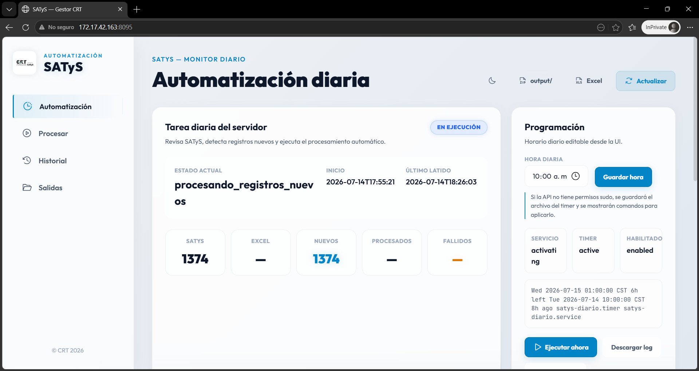
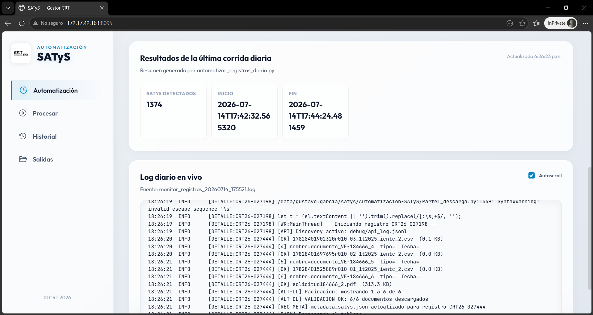
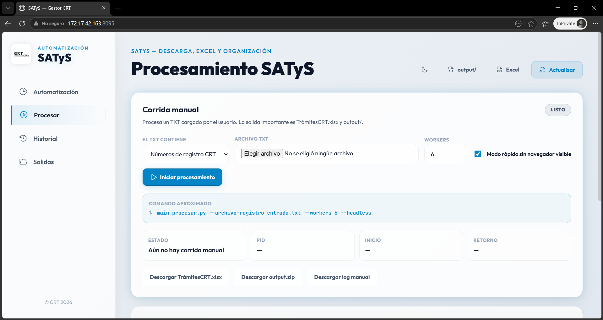
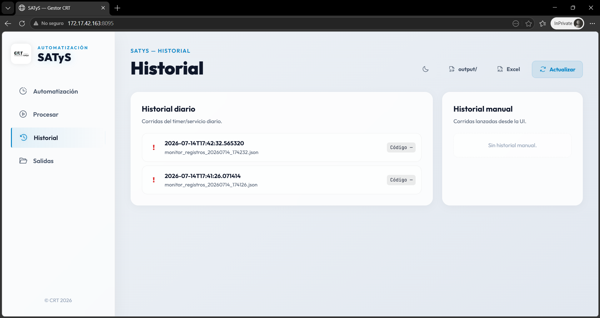

# 📋 Proyecto SATyS - Automatización de Descargas y Procesamiento (Linux)

**Sistema Automatizado de Trámites y Servicios (SATyS)**
**Comisión Reguladora de Telecomunicaciones (CRT)**

Versión para servidor Linux (Red Hat Enterprise Linux). Reemplaza la versión anterior en Windows: sin Python embebido, sin GUI de escritorio (Flet) y con un panel web + `systemd` para operación desatendida.

---

## 🎯 Descripción general

Automatización del flujo completo de **descarga, procesamiento y organización** de trámites del sistema SATyS del IFT/CRT. El sistema:

- Revisa todos los días la tabla **Documentos en Proceso** del SATyS y detecta números de **Registro** nuevos comparando contra `TrámitesCRT.xlsx` (columna `1711`).
- Extrae metadatos del trámite directamente de la web (sin OCR).
- Descarga en paralelo todos los archivos asociados a cada registro/folio, con reintentos automáticos.
- Consulta el Registro Público de Concesiones (RPC) por comparación exacta `id_solicitante == ID OPERADOR`.
- Actualiza `TrámitesCRT.xlsx` y organiza los archivos descargados en `/output/<operador>/`.
- Genera un Excel consolidado (`output/Folios_Datos_Completos.xlsx`) con todos los campos extraídos.
- Reconcilia automáticamente `TrámitesCRT.xlsx` contra ese consolidado: una fila por Registro, rutas completas y sin filas fantasma de ZIP.
- Envía una notificación por correo con el resumen de cada corrida.
- Corre de forma desatendida vía `systemd` (timer diario) y expone un panel web (FastAPI) para monitoreo y ejecución manual.

### 🔄 Flujo del proceso

```
┌───────────────────────────────────────────────────────────────────┐
│                          PROYECTO SATyS                             │
├───────────────────────────────────────────────────────────────────┤
│  MONITOR DIARIO (automatizar_registros_diario.py)                   │
│  ├── Login en https://satys.ift.org.mx/                             │
│  ├── Extrae columna "Registro" de Documentos en Proceso             │
│  ├── Compara contra TrámitesCRT.xlsx (columna 1711)                 │
│  └── Genera registros.txt solo con registros nuevos                 │
│                                                                       │
│  PARTE 1 — DESCARGA (Playwright, headless)                          │
│  ├── Búsqueda del registro/folio en Oficialía de Partes              │
│  ├── Extracción de metadatos del trámite vía JS de la página        │
│  ├── Descarga en paralelo de todos los archivos asociados           │
│  │   └── Hasta 3 intentos por archivo → si falla: ERROR_SERVIDOR    │
│  ├── Descompresión de los .zip encontrados                          │
│  └── Organización temporal en descargas/<registro>/                 │
│                                                                       │
│  PARTE 3 — BÚSQUEDA EN RPC                                          │
│  ├── Descarga/actualización del catálogo de Concesiones             │
│  ├── Comparación exacta id_solicitante == ID OPERADOR               │
│  │   (100% si existe en el Excel oficial, 0% si no existe)          │
│  └── Construcción de ruta estandarizada por operador                │
│                                                                       │
│  PARTE 4 — EXCEL Y CARPETAS                                         │
│  ├── Inserción de resultados en TrámitesCRT.xlsx                    │
│  └── Copia final a output/<operador>/ u output/_sin_operador/    │
│                                                                       │
│  EXPORTACIÓN FINAL                                                   │
│  ├── Genera/actualiza output/Folios_Datos_Completos.xlsx            │
│  ├── Reconcilia TrámitesCRT.xlsx por número de Registro             │
│  ├── Sobrescribe TrámitesCRT.xlsx y hace merge de output/ y descargas/ en CRT Recurso DEPI
│  └── Envía notificación por correo con el resumen de la corrida     │
└───────────────────────────────────────────────────────────────────┘
```

> `Parte2_extraer.py` (extracción de PDF vía Azure/pdfplumber) se conserva por compatibilidad pero **no se usa en producción**; el flujo real usa los metadatos obtenidos directamente del SATyS.

---

## 🖥️ Panel web (reemplaza la GUI de Windows)

La antigua interfaz de escritorio (Flet) fue reemplazada por un panel web servido con **FastAPI** (`satys_api.py`), sin frameworks de frontend ni build tools — solo HTML/CSS/JS servidos directamente.

Incluye:

1. **Automatización diaria**: estado en vivo del timer/servicio `systemd`, resumen de la última corrida y log en tiempo real.
2. **Procesar manualmente**: subir un `.txt` de folios o de registros y lanzar una corrida sin usar la terminal.
3. **Historial**: corridas diarias y manuales anteriores.
4. **Descargas**: `TrámitesCRT.xlsx`, `output/Folios_Datos_Completos.xlsx`, `output.zip`, `descargas.zip`.

Levantar en modo prueba:

```bash
uvicorn satys_api:app --host 0.0.0.0 --port 8080
```

Detalles completos de endpoints y variables en [`README_FRONTEND_LINUX.md`](README_FRONTEND_LINUX.md).

## Screenshots











---

## 📁 Estructura del proyecto

```
Automatizacion-SATyS/
│
├── main_procesar.py                  # Orquestador principal (Partes 1, 3, 4 + Excel consolidado)
├── automatizar_registros_diario.py   # Monitor diario: detecta registros nuevos y llama a main_procesar.py
├── Parte1_descarga.py                # Automatización web del SATyS (Playwright)
├── Parte2_extraer.py                 # Extracción de PDFs (Azure AI / pdfplumber) — no usado en producción
├── Parte3_rpc.py                     # Búsqueda y homologación en el RPC
├── Parte4_excel.py                   # Escritura en TrámitesCRT.xlsx y organización de /output/
├── extraer_registros_documentos.py   # Extrae la tabla "Documentos en Proceso" del SATyS
├── generar_excel_folios.py           # Generación del Excel consolidado (versión folios)
├── generar_excel_metadata_json.py    # Generación de output/Folios_Datos_Completos.xlsx desde JSON
├── buscar_concesionario.py           # Búsqueda exacta en el padrón RPC
├── descargar_concesiones_rpc.py      # Descarga/actualización del catálogo RPC
├── login_satys.py                    # Login al SATyS
├── notificar_email.py                # Notificación por correo al finalizar cada corrida
├── configuracion_local.py             # Lector de config/configuracion_local.json
├── estado_descargas.py                # Regla única de completo/reintento
├── sincronizacion_depi.py             # Merge no destructivo hacia CRT Recurso DEPI
├── config/configuracion_local.json    # Credenciales/rutas locales (chmod 600; no versionar)
├── proceso_lock.py                   # Lock compartido para evitar corridas simultáneas
├── estado_ejecucion.py               # Escribe logs/estado_actual.json (estado vivo para el panel)
├── satys_api.py                      # Backend FastAPI del panel web
│
├── web/
│   ├── templates/index.html          # Panel web
│   └── static/                       # CSS y JS del panel
│
├── scripts/
│   ├── run_satys_diario.sh           # Wrapper de ejecución diaria (usado por systemd)
│   ├── estado_satys.sh               # Diagnóstico rápido de servicio/timer/estado
│   └── health_satys.py               # Lee logs/estado_actual.json y valida frescura
│
├── systemd/
│   ├── satys-diario.service          # Corrida diaria (oneshot)
│   ├── satys-diario.timer            # Programación diaria (01:00 AM, America/Mexico_City)
│   └── satys-api.service             # Servicio del panel web (FastAPI/uvicorn)
│
├── TrámitesCRT.xlsx                  # Hoja de control maestro
├── requirements-linux.txt            # Dependencias Python para Linux
│
├── descargas/<registro>/             # Carpeta de tránsito (archivos recién descargados)
├── output/                           # Destino final organizado por operador
│   ├── <id>_<nombre_operador>/
│   ├── _sin_operador/                # Sin coincidencia en RPC → revisión manual
│   └── Folios_Datos_Completos.xlsx   # Excel consolidado
├── registros_diarios/                # Copias históricas de los TXT de registros detectados
├── base_de_datos_rpc/                # Catálogo de Concesiones RPC descargado
└── logs/                             # Logs de ejecución y estado_actual.json
```

Documentación adicional incluida en el repo:

- [`README_BACKEND_LINUX.md`](README_BACKEND_LINUX.md) — instalación, `systemd`, variables de entorno, monitoreo.
- [`README_FRONTEND_LINUX.md`](README_FRONTEND_LINUX.md) — panel web, endpoints, permisos de la UI.
- [`README_ESTADO_SERVIDOR_ACTUAL.md`](README_ESTADO_SERVIDOR_ACTUAL.md) — bitácora del despliegue real en el servidor (rutas, montajes, troubleshooting).
- [`INSTRUCCIONES_DESPLIEGUE_FINAL_LOCK_SATYS.md`](INSTRUCCIONES_DESPLIEGUE_FINAL_LOCK_SATYS.md) — checklist de despliegue con lock seguro y correo.

---


## 📍 Ruta canónica del paquete compartido DEPI

En este proyecto, cualquier ejemplo que use `/ruta/<archivo>.zip` **no es una ruta literal**. El directorio compartido canónico para los paquetes de despliegue es siempre:

```text
/depi/DEI_DATOS/SATyS/satys_fullstack_montaje_depi/Automatizacion-SATyS
```

Por ejemplo, la ruta completa del parche de reanudación es:

```text
/depi/DEI_DATOS/SATyS/satys_fullstack_montaje_depi/Automatizacion-SATyS/parche-satys-reanudacion-id-20260717.zip
```

Se recomienda declarar la ruta una sola vez:

```bash
ORIGEN_DEPI=/depi/DEI_DATOS/SATyS/satys_fullstack_montaje_depi/Automatizacion-SATyS
PATCH_ZIP="$ORIGEN_DEPI/parche-satys-reanudacion-id-20260717.zip"
test -f "$PATCH_ZIP"
```

El proyecto que ejecutan `systemd` y la UI continúa instalado en:

```text
/data/gustavo.garcia/satys/Automatizacion-SATyS
```

La carpeta DEPI es el origen compartido de paquetes y salidas; no debe confundirse con la copia activa del servidor.

### Si ya existe una corrida con archivos descargados

No borres ni reemplaces `descargas/`, `output/`, `TrámitesCRT.xlsx`, `config/` ni `logs/`. Aplica únicamente el parche por superposición. La corrida diaria normal omite la descarga de registros cuya carpeta `descargas/<REGISTRO>/` ya contiene al menos un archivo real, pero vuelve a procesar los metadatos, RPC, Excel y rutas existentes.

Para reparar solamente los `id_solicitante` vacíos de una corrida anterior, primero analiza y después ejecuta el reparador **sin** `--redescargar-archivos`:

```bash
/data/gustavo.garcia/satys/venv/bin/python reparar_id_solicitante.py \
  --reiniciar-cola \
  --solo-analizar

/data/gustavo.garcia/satys/venv/bin/python reparar_id_solicitante.py \
  --reintentos 2 \
  --headless
```

El modo predeterminado vuelve a consultar SATyS únicamente para completar el metadato y reutiliza los documentos existentes. Usa `--redescargar-archivos` solo como último recurso y después de respaldar `descargas/`, porque puede crear duplicados.

### Ejecución automática y manual

- `satys-diario.timer` genera una activación de calendario cada día a las **01:00:00 `America/Mexico_City`**.
- `Persistent=false` mantiene el horario estricto: si el servidor está apagado a la 01:00, no se dispara una corrida tardía al encenderlo.
- `satys-diario.service` usa `Restart=no`: los errores de negocio o registros fallidos no vuelven a lanzar toda la automatización.
- `scripts/run_satys_diario.sh` añade una guarda por fecha en `runs/daily_guard/`; un segundo arranque normal del mismo día se omite sin enviar correo.
- La misma corrida diaria puede solicitarse manualmente desde la UI o con `sudo systemctl start --no-block satys-diario.service`, pero la guarda evita una segunda ejecución en la misma fecha.
- `reparar_id_solicitante.py` es **exclusivamente manual**: no está asociado a ningún timer.
- El bloqueo del proyecto impide que la corrida diaria, una corrida manual y el reparador modifiquen simultáneamente los mismos archivos.

## 📦 Instalación

Requiere **Python 3.11+** y acceso a red interna del CRT/IFT.

```bash
python3.11 -m venv venv
source venv/bin/activate
python -m pip install --upgrade pip
pip install -r requirements-linux.txt
python -m playwright install chromium
```

En RHEL, **no uses** `playwright install-deps chromium` (usa `apt-get` y falla). Si Playwright reporta librerías faltantes, instálalas con `dnf`:

```bash
sudo dnf install -y \
  nss nspr atk at-spi2-atk cups-libs libdrm \
  libXcomposite libXdamage libXrandr mesa-libgbm pango \
  alsa-lib libxshmfence libXtst libX11 libxcb libXext \
  libXi libXrender libXfixes libXcursor libXinerama \
  fontconfig freetype liberation-fonts
```

---

## ⚙️ Configuración local del servidor

La configuración operativa se encuentra en `config/configuracion_local.json`:

```json
{
  "satys": {"usuario": "...", "password": "..."},
  "gmail": {"remitente": "...", "app_password": "...", "destinatarios": ["..."]},
  "rutas": {
    "descargas": "descargas",
    "output": "output",
    "excel": "TrámitesCRT.xlsx",
    "carpeta_compartida": "/depi/DEI_DATOS/SATyS"
  },
  "procesamiento": {
    "workers": 10,
    "timeout_registro": 900,
    "reintentos_registro": 2,
    "workers_reintento": 2
  }
}
```

Aplicar permisos restrictivos:

```bash
chmod 600 config/configuracion_local.json
```

Las credenciales ya no están hardcodeadas ni se leen de `SATYS_USER`, `SATYS_PASS` o variables equivalentes. El archivo real está excluido por `.gitignore`; `config/configuracion_local.example.json` sirve como plantilla.

> **Riesgo aceptado:** las contraseñas existentes no fueron rotadas por decisión operativa. Moverlas fuera del código reduce la exposición futura, pero no invalida copias anteriores, ZIP previos o historial Git que pudieran contenerlas.

Variables de entorno que siguen siendo operativas para infraestructura, no para credenciales: `SATYS_PYTHON`, `SATYS_LOCK_DIR`, `SATYS_HEADLESS`, `PLAYWRIGHT_BROWSERS_PATH` y permisos del panel web.

---

## 🚀 Uso en terminal

```bash
# Procesar registros/folios específicos:
python main_procesar.py 6407 6801

# Procesar desde un archivo de folios:
python main_procesar.py --archivo-folios folios.txt --headless --workers 10

# Procesar desde un archivo de números de Registro (ej. CRT26-002483):
python main_procesar.py --archivo-registro registros.txt --headless --workers 10

# Solo procesar archivos ya descargados (sin entrar al SATyS):
python main_procesar.py --solo-procesar

# Reconstruir el catálogo RPC desde cero:
python main_procesar.py --rebuild-catalogo

# Ejecutar el monitor diario manualmente (detecta y procesa solo lo nuevo):
python automatizar_registros_diario.py --headless --workers 10
```

### Argumentos de `main_procesar.py`

| Argumento                        | Descripción                                                                         |
| -------------------------------- | ------------------------------------------------------------------------------------ |
| `[folios]`                     | Folios a procesar como argumentos posicionales                                       |
| `--archivo-folios`             | Ruta a`.txt` con folios, uno por línea                                            |
| `--archivo-registro`           | Ruta a`.txt` con números de Registro; activa el modo de búsqueda por Registro    |
| `--solo-procesar`              | Omite la descarga (Parte 1) y procesa solo archivos ya locales                       |
| `--headless`                   | Oculta el navegador de Playwright                                                    |
| `--workers N`                  | Ventanas de navegador en paralelo (default: 10)                                      |
| `--timeout-registro N`         | Timeout duro por registro en segundos (default: 900)                                 |
| `--reintentos-registro N`      | Reintentos para registros incompletos (default: 2)                                   |
| `--workers-reintento N`        | Workers usados en los reintentos (default: 2)                                        |
| `--buscar N` / `--desde X`   | Búsqueda secuencial de`N` folios a partir de `X`                                |
| `--no-organizar`               | Actualiza el Excel pero no mueve archivos a`/output/`                              |
| `--rebuild-catalogo`           | Reconstruye el catálogo RPC desde cero                                              |
| `--sin-email` / `--email-to` | Omite o redirige la notificación por correo                                         |
| `--sin-lock`                   | No toma el lock compartido (usado internamente cuando el monitor diario ya lo tomó) |

### Argumentos propios de `automatizar_registros_diario.py`

| Argumento                                       | Descripción                                                             |
| ----------------------------------------------- | ------------------------------------------------------------------------ |
| `--excel`, `--sheet`, `--header-registro` | Excel/columna contra la que se compara para detectar registros nuevos    |
| `--registros-latest`, `--registros-dir`     | TXT de salida y carpeta de copias históricas                            |
| `--max-paginas`, `--timeout-tabla`          | Paginación y timeout al leer la tabla "Documentos en Proceso"           |
| `--no-procesar`                               | Solo genera el TXT de nuevos registros, sin ejecutar`main_procesar.py` |
| `--visible`                                   | Fuerza navegador visible para depuración                                |
| `--estado-json`                               | Ruta del JSON de estado vivo                                             |

---

## ⏱️ Automatización diaria con `systemd`

> Despliegue recomendado: `sudo bash scripts/instalar_linux_1am.sh --user <usuario>`. Consulta [`DESPLIEGUE_1AM.md`](DESPLIEGUE_1AM.md).

El proceso diario corre por `systemd` en vez de `schtasks` (Windows) o `cron`, con logs centralizados, horario estricto y una guarda adicional que limita la ejecución normal a una vez por fecha.

```bash
sudo cp systemd/satys-diario.service systemd/satys-diario.timer /etc/systemd/system/
sudo systemctl daemon-reload
sudo systemctl enable --now satys-diario.timer
systemctl list-timers | grep satys
```

Ejecutar manualmente / ver logs en vivo:

```bash
sudo systemctl start satys-diario.service
journalctl -u satys-diario.service -f
```

Estado rápido:

```bash
./scripts/estado_satys.sh
cat logs/estado_actual.json
```

### Panel web como servicio

```bash
sudo cp systemd/satys-api.service /etc/systemd/system/
sudo systemctl daemon-reload
sudo systemctl enable --now satys-api.service
```

Ver [`README_BACKEND_LINUX.md`](README_BACKEND_LINUX.md) para los endpoints del panel y detalles de despliegue completos.

---

## 🔒 Lock compartido

`proceso_lock.py` evita que dos corridas se ejecuten al mismo tiempo. En corridas manuales/API, `main_procesar.py` toma el lock. En la corrida diaria, `automatizar_registros_diario.py` toma el lock y llama a `main_procesar.py --sin-lock`. El lock se libera siempre en `finally` (al terminar, fallar, `Ctrl+C` o `systemctl stop`). Si el proceso murió de forma abrupta (apagón, `kill -9`), y ya se confirmó que no quedan procesos vivos, el lock puede liberarse manualmente:

```bash
ps -ef | grep -E 'main_procesar|automatizar_registros_diario|Parte1_descarga|chromium|playwright' | grep -v grep
rm -f "$SATYS_LOCK_DIR/satys_proceso.lock"
```

---

## 📊 Excel consolidado (`output/Folios_Datos_Completos.xlsx`)

Se genera/actualiza al finalizar cada corrida con una fila por registro/folio, agregando todos los campos disponibles en `metadata_satys.json` y `metadata_tramite_nuevo.json` (folio, registro, asunto, operador, representante legal, tipo de trámite, fechas, etc.), más la ruta relativa donde quedó organizado en `output/` y `descargas/`. Si el archivo ya existe, los registros nuevos se agregan al final sin borrar los anteriores.

## 📊 Excel de control (`TrámitesCRT.xlsx`)

| Columna                | Letra | Contenido                                           |
| ---------------------- | ----- | --------------------------------------------------- |
| Solicitante Promovente | F     | Operador encontrado en el RPC                       |
| Ruta                   | N     | Ruta construida desde el padrón RPC                |
| R001–R027             | O–AQ | `"1"` si el formato fue detectado en los archivos |
| NOTAS_VICTOR           | AP    | Tipos de archivo descargados (xlsx, csv, pdf, etc.) |

---

## 🩺 Diagnóstico rápido

```bash
# Panel web
systemctl status satys-api.service --no-pager -l
curl http://127.0.0.1:8080/api/health

# Proceso diario
systemctl list-timers | grep satys
journalctl -u satys-diario.service -n 200 --no-pager

# Estado vivo
cat logs/estado_actual.json
```

Más detalle operativo (montajes de red, permisos, puertos usados) en [`README_ESTADO_SERVIDOR_ACTUAL.md`](README_ESTADO_SERVIDOR_ACTUAL.md).

---

## 🔮 Estado del proyecto

### ✅ Completado

- [X] Migración completa de Windows (Python embebido + Flet) a Linux (`venv` + `systemd`)
- [X] Panel web (FastAPI) para monitoreo y corridas manuales, en reemplazo de la GUI de escritorio
- [X] Automatización diaria vía `systemd timer`, con estado vivo en `logs/estado_actual.json`
- [X] Lock compartido con liberación garantizada en corridas manuales, API y diarias
- [X] Búsqueda RPC por comparación exacta `id_solicitante == ID OPERADOR`
- [X] Notificación por correo al finalizar cada corrida
- [X] Exportación de Excel consolidado `Folios_Datos_Completos.xlsx`

### 🔲 Pendiente

- [x] Credenciales retiradas del código y leídas desde `config/configuracion_local.json`
- [ ] Dashboard interactivo de estadísticas
- [ ] Soporte para reanudar desde el último punto en caso de apagón o cierre abrupto
- [ ] Encontrar o crear una API oficial para el sitio SATyS

---

## 👤 Autor

**Proyecto desarrollado para:**

- Comisión Reguladora de Telecomunicaciones (CRT)
- Coordinación General de Planeación Estratégica
- Dirección Ejecutiva de Indicadores (DEI)

**Desarrolladores:**

- Gustavo Ivan Garcia Quiroz
- David Palestina Ramirez

**Actualizaciones y despliegue en Linux:** Equipo de la Dirección Ejecutiva de Indicadores
**Contacto:** david.palestina@crt.gob.mx

---

## 📄 Licencia

Este proyecto es propiedad de la Comisión Reguladora de Telecomunicaciones (CRT). Uso interno exclusivamente.

---

## ⚡ Optimización del catálogo RPC (17 de julio de 2026)

La carga del XLSX oficial RPC usa una lectura secuencial con
`openpyxl.iter_rows(values_only=True)`. No debe reemplazarse por llamadas
repetidas a `ws.cell()` cuando el libro está abierto con `read_only=True`, ya
que eso puede convertir la lectura en un proceso aproximadamente cuadrático.

Antes de una corrida completa puede validarse el catálogo local sin descargar
ni modificar información:

```bash
cd /data/gustavo.garcia/satys/Automatizacion-SATyS

/data/gustavo.garcia/satys/venv/bin/python \
  scripts/validar_catalogo_rpc.py \
  --esperados 9166
```

El parche de esta corrección se publica siempre en la carpeta compartida:

```text
/depi/DEI_DATOS/SATyS/satys_fullstack_montaje_depi/Automatizacion-SATyS
```

Nombre del parche:

```text
parche-satys-optimizacion-rpc-20260717.zip
```

Ruta completa:

```text
/depi/DEI_DATOS/SATyS/satys_fullstack_montaje_depi/Automatizacion-SATyS/parche-satys-optimizacion-rpc-20260717.zip
```

Aplicar este parche no elimina ni vuelve a descargar `descargas/`, `output/`,
`logs/`, `TrámitesCRT.xlsx` ni la configuración local.

---

## 🚀 RELEASE COMPLETA — REEMPLAZO TOTAL DE CÓDIGO

El paquete completo se publica en la carpeta compartida:

```text
/depi/DEI_DATOS/SATyS/satys_fullstack_montaje_depi/Automatizacion-SATyS
```

Archivo de release:

```text
/depi/DEI_DATOS/SATyS/satys_fullstack_montaje_depi/Automatizacion-SATyS/automatizacion-satys-release-final-20260717.zip
```

Esta modalidad reemplaza toda la carpeta de código activa en:

```text
/data/gustavo.garcia/satys/Automatizacion-SATyS
```

No se hace una superposición parcial. La instalación anterior se renombra como respaldo y se conserva únicamente la información operativa: descargas, resultados, logs, configuración local, sesión, catálogo RPC y Excel vigente.

Después de extraer el ZIP, ejecutar:

```bash
sudo env SATYS_PYTHON_BIN=/data/gustavo.garcia/satys/venv/bin/python \
  bash /tmp/satys-release-final/desplegar_release_completa.sh
```

El despliegue instala o actualiza dependencias, levanta la UI/API y deja habilitado el timer diario a la **01:00 `America/Mexico_City`**. No inicia una corrida completa durante el despliegue, salvo que se añada `--run-now`.


## Corrección de múltiples correos (2026-07-20)

Consulta [`CORRECCION_EJECUCION_UNICA_20260720.md`](CORRECCION_EJECUCION_UNICA_20260720.md) para aplicar y validar la protección de una corrida por día.
