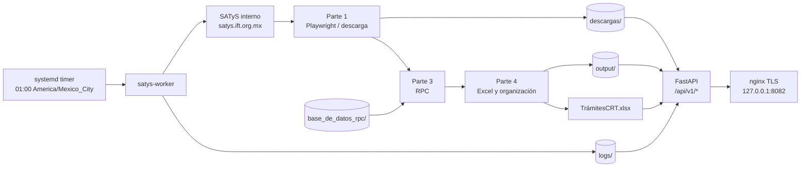

# Arquitectura

## Ejecución en contenedores

`satys-api` es de larga duración. `satys-worker` es efímero y se ejecuta mediante `docker compose run --rm satys-worker`. El timer Docker incluido en `systemd/satys-docker-diario.*` invoca ese worker una vez al día.

## Persistencia

Los directorios `descargas/`, `output/`, `logs/`, `runs/`, `exports/`, `base_de_datos_rpc/` y `registros_diarios/`, además de `TrámitesCRT.xlsx` y `config/configuracion_local.json`, se montan desde el host y no se hornean en la imagen.
