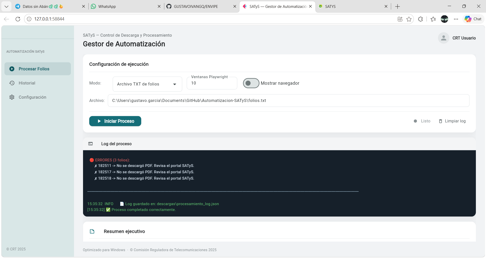
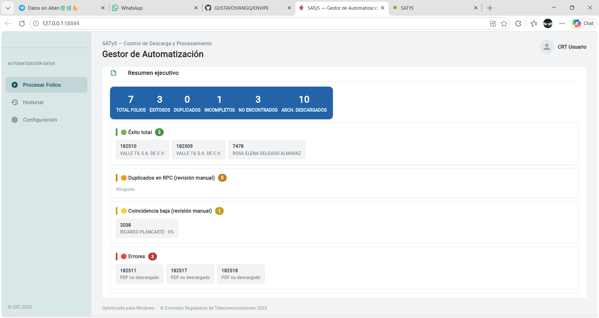
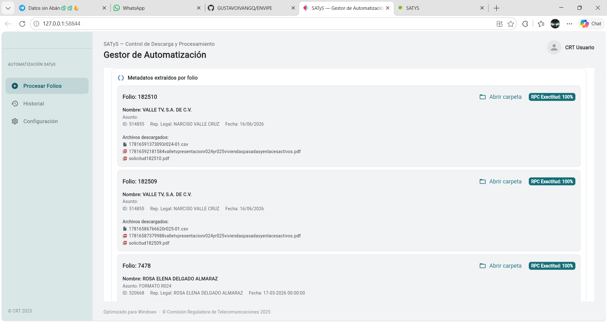
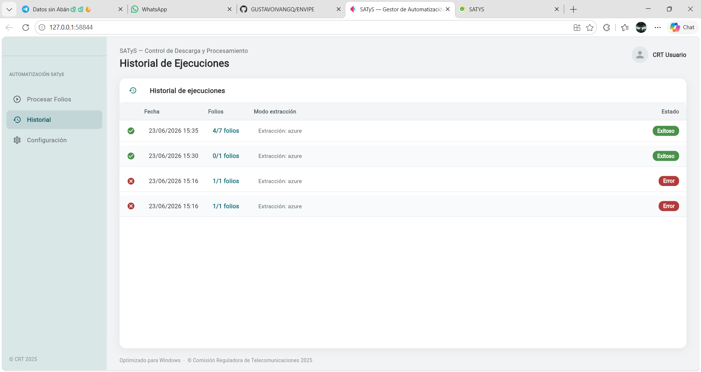
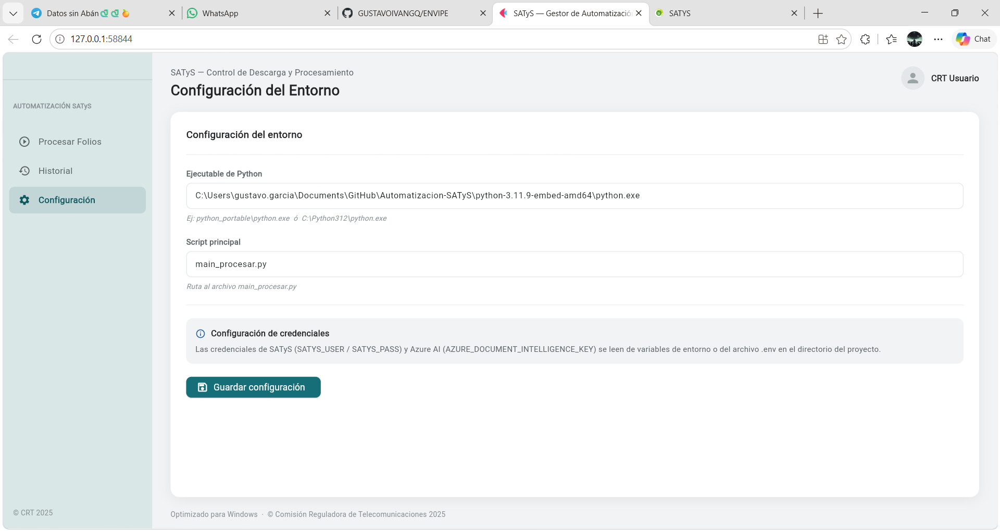

# 📋 Proyecto SATyS - Automatización de Descargas y Procesamiento

**Sistema Automatizado de Trámites y Servicios (SATyS)**
**Comisión Reguladora de Telecomunicaciones (CRT)**

---

## 🖥️ Interfaz Gráfica (Recomendada)

Se cuenta con una **Interfaz Gráfica de Usuario (GUI)** para orquestar todo el flujo de trabajo sin necesidad de usar comandos en la terminal. Desde aquí puedes seguir el progreso en tiempo real y consultar el Resumen Ejecutivo de los resultados.

### 🚀 Configuración Recomendada

- **Folios:** Cargar un **Archivo TXT** (ej. `folios.txt`) con un folio por línea.
- **Ventanas Playwright:** Configurar en **6** (buena paralelización sin saturar la red).
- **Mostrar navegador:** Mantener **Apagado** (modo Headless). Esto evita abrir ventanas visibles de Chromium, consumiendo menos memoria y acelerando la ejecución.

Para iniciar la interfaz ejecuta:

```bash
.\python-3.11.9-embed-amd64\python.exe ui_satys.py
```

### 📸 Galería de la Interfaz







---

## 🎯 Descripción General

Automatización completa del flujo de trabajo para la **descarga, procesamiento y organización de archivos** del sistema SATyS del Comisión Reguladora de Telecomunicaciones (CRT). El sistema:

- Extrae metadatos de los trámites directamente de la web (sin OCR).
- Consulta el Registro Público de Concesiones (RPC) vía API REST y Fuzzy Matching.
- Actualiza automáticamente la hoja de cálculo de control `TrámitesCRT.xlsx`.
- Organiza los archivos descargados en carpetas `/output/` clasificadas por operador.
- Genera un **Excel consolidado** con los datos de todos los folios procesados.

### 🔄 Flujo Completo del Proceso

```
┌─────────────────────────────────────────────────────────────┐
│                    PROYECTO SATyS                            │
├─────────────────────────────────────────────────────────────┤
│                                                              │
│  PARTE 1 — DESCARGA AUTOMÁTICA (Playwright)                 │
│  ├── Login en https://satys.ift.org.mx/                     │
│  ├── Búsqueda de folios en Oficialía de Partes              │
│  ├── Extracción de metadatos del trámite vía web (JS)       │
│  ├── Descarga en paralelo de todos los archivos asociados   │
│  │   └── Reintentos por archivo: hasta 3 intentos           │
│  │   └── Si falla → marcado como ERROR_SERVIDOR (externo)   │
│  ├── Descompresión de todos los .zip encontrados            │
│  └── Organización temporal en /descargas/<folio>/           │
│                                                             │
│  PARTE 2 — EXTRACCIÓN DE DATOS PDF                          │
│  ├── Azure AI Document Intelligence (nube, preciso)         │
│  └── pdfplumber (local, sin internet, como fallback)        │
│                                                             │
│  PARTE 3 — BÚSQUEDA EN RPC                                  │
│  ├── Descarga automática de la BD de Concesiones más nueva  │
│  ├── Fuzzy Matching inteligente por nombre de operador      │
│  ├── Búsqueda complementaria vía API REST del RPC           │
│  └── Construcción de ruta estandarizada por operador        │
│                                                             │
│  PARTE 4 — ACTUALIZACIÓN DE EXCEL Y CARPETAS                │
│  ├── Inserción de resultados en TrámitesCRT.xlsx            │
│  └── Traslado final a /output/<operador>/ o /output/_sin_operador/
│                                                             │
│  EXPORTACIÓN FINAL — EXCEL CONSOLIDADO DE FOLIOS            │
│  └── Genera/Actualiza output/Folios_Datos_Completos.xlsx    │
│                                                             │
└─────────────────────────────────────────────────────────────┘
```

---

## ✅ Comportamiento Clave del Sistema

1. **Metadatos extraídos directamente del SATyS (vía JavaScript):** Los campos `representante_legal`, `id_representante_legal`, `nombre_operador` e `id_solicitante` se obtienen de la página web del trámite mediante un bucle infinito que espera a que los datos carguen. Son campos obligatorios y siempre están presentes en el portal.
2. **Reintentos de descarga por archivo (3 intentos):** Cada archivo se intenta descargar hasta 3 veces. Si falla en los 3, se marca como `ERROR_SERVIDOR` (problema externo al programa) y el flujo continúa con el siguiente archivo.
3. **Validación de Identidad del Operador:** Cruza el nombre/ID obtenido en el SATyS contra el padrón del RPC. Si no hay coincidencia confiable, el folio va a `/output/_sin_operador/` para revisión manual.
4. **Base de Datos RPC Automática:** Al iniciar, el programa verifica si existe una versión más reciente del catálogo de concesiones y lo descarga en segundo plano.
5. **Excel Consolidado:** Al terminar de procesar, genera o actualiza `output/Folios_Datos_Completos.xlsx` agregando una fila por folio con todos sus metadatos. Si el archivo ya existe, solo se agregan filas nuevas al final.

---

## 📁 Estructura del Proyecto

```
Automatizacion-SATyS/
│
├── ui_satys.py                  # Interfaz Gráfica (GUI) principal
├── main_procesar.py             # Orquestador principal (ejecuta Partes 1-4 + Excel)
├── Parte1_descarga.py           # Automatización web de SATyS (Playwright)
├── Parte2_extraer.py            # Extracción de datos de PDFs (Azure AI / pdfplumber)
├── Parte3_rpc.py                # Búsqueda y homologación en RPC (Fuzzy Matching)
├── Parte4_excel.py              # Escritura en TrámitesCRT.xlsx y organización /output/
├── generar_excel_folios.py      # Generación del Excel consolidado de folios
├── merge_retroactive.py         # Utilidad para reprocesar folios anteriores
│
├── TrámitesCRT.xlsx             # Hoja de cálculo de control maestro
├── folios.txt                   # Lista de folios a procesar (uno por línea)
├── .env.example                 # Variables de entorno (credenciales)
│
├── descargas/                   # Carpeta de tránsito (archivos recién descargados)
│   └── <folio>/
│       ├── metadata_satys.json          # Metadatos extraídos de la web SATyS
│       ├── metadata_tramite_nuevo.json  # Metadatos del trámite (API RPC)
│       ├── metadata_completo.json       # JSON consolidado (resultado final)
│       └── <archivos descargados>
│
├── output/                      # Destino final: carpetas homologadas y limpias
│   ├── <id>_<nombre_operador>/  # Carpeta del operador encontrado en RPC
│   ├── _sin_operador/           # Folios sin coincidencia (requieren revisión manual)
│   └── Folios_Datos_Completos.xlsx  # Excel consolidado de todos los folios
│
├── base_de_datos_rpc/           # Catálogo de Concesiones RPC descargado
├── buscar_concesionario/        # Módulo de búsqueda en Excel RPC
├── extraer_datos/               # Módulo de extracción Azure AI
├── logs/                        # Logs de ejecución
└── python-3.11.9-embed-amd64/   # Python portátil (no requiere instalación)
```

---

## 📦 Dependencias

El proyecto usa **Python 3.11 portátil** (incluido en `python-3.11.9-embed-amd64/`). No se requiere instalar Python en el sistema.

Librerías principales requeridas:

```bash
pip install playwright pdfplumber fuzzywuzzy python-Levenshtein openpyxl flet
playwright install chromium
```

Variables de entorno (ver `.env.example`):

```env
SATYS_USER=tu_usuario@ift.org.mx
SATYS_PASS=tu_contraseña
AZURE_DOCUMENT_INTELLIGENCE_KEY=tu_clave_azure
```

---

## 🚀 Uso en Terminal (Modo Avanzado)

```bash
# Procesar folios específicos (por argumentos):
.\python-3.11.9-embed-amd64\python.exe main_procesar.py 176464 179220

# Procesar folios desde un archivo .txt (recomendado):
.\python-3.11.9-embed-amd64\python.exe main_procesar.py --archivo-folios folios.txt --headless

# Procesar en segundo plano con 6 ventanas paralelas:
.\python-3.11.9-embed-amd64\python.exe main_procesar.py --archivo-folios folios.txt --headless --workers 6

# Solo procesar archivos ya descargados (sin entrar al SATyS):
.\python-3.11.9-embed-amd64\python.exe main_procesar.py --solo-procesar

# Forzar reconstrucción de la base de datos RPC local:
.\python-3.11.9-embed-amd64\python.exe main_procesar.py --rebuild-catalogo
```

### 📋 Lista de argumentos disponibles

| Argumento              | Descripción                                                                    |
| ---------------------- | ------------------------------------------------------------------------------- |
| `[folios]`           | Números de folios separados por espacio. Ej:`main_procesar.py 176464 179220` |
| `--archivo-folios`   | Ruta a un`.txt` con un folio por línea. Ej: `--archivo-folios folios.txt`  |
| `--headless`         | Oculta el navegador Playwright (recomendado para velocidad)                     |
| `--workers N`        | Número de ventanas del navegador en paralelo. Por defecto`10`                |
| `--solo-procesar`    | Omite la Parte 1 (descarga web) y procesa archivos ya descargados localmente    |
| `--buscar N`         | Busca y procesa`N` folios secuencialmente a partir de `--desde`             |
| `--desde X`          | Folio base para la búsqueda secuencial. Por defecto`6407`                    |
| `--no-organizar`     | Extrae y actualiza el Excel, pero no mueve archivos a`/output/`               |
| `--rebuild-catalogo` | Reconstruye el catálogo RPC desde cero descargándolo de nuevo                 |

---

## 📊 Excel Consolidado de Folios (`Folios_Datos_Completos.xlsx`)

Generado automáticamente al finalizar cada corrida, con una fila por folio:

| Columna                    | Fuente JSON                                               |
| -------------------------- | --------------------------------------------------------- |
| `FOLIO`                  | `metadata_satys.json`                                   |
| `REGISTRO`               | `metadata_satys.json`                                   |
| `ASUNTO`                 | `metadata_satys.json` / `metadata_tramite_nuevo.json` |
| `NOMBRE_OPERADOR`        | `metadata_satys.json` / `metadata_tramite_nuevo.json` |
| `REPRESENTANTE_LEGAL`    | `metadata_satys.json` / `metadata_tramite_nuevo.json` |
| `ID_REPRESENTANTE_LEGAL` | `metadata_satys.json`                                   |
| `ID_SOLICITANTE`         | `metadata_satys.json`                                   |
| `TIPO_TRAMITE`           | `metadata_satys.json` / `metadata_tramite_nuevo.json` |
| `FECHA_REGISTRO`         | `metadata_satys.json` / `metadata_tramite_nuevo.json` |
| `FECHA_EJECUCION`        | `metadata_satys.json`                                   |
| `FECHA_FOLIO_OPC`        | `metadata_satys.json`                                   |

> Si el archivo Excel ya existe, los nuevos folios se agregan al final sin borrar los anteriores. Cierra el archivo antes de ejecutar el programa para evitar errores de permisos.

---

## 📊 Excel de Control (`TrámitesCRT.xlsx`)

El orquestador actualiza columnas específicas de este Excel de control:

| Columna                | Letra | Contenido                                           |
| ---------------------- | ----- | --------------------------------------------------- |
| Solicitante Promovente | F     | Nombre del operador encontrado en RPC               |
| Ruta                   | N     | Ruta construida desde el padrón RPC                |
| R001–R027             | O–AQ | `"1"` si el formato fue detectado en los archivos |
| NOTAS_VICTOR           | AP    | Tipos de archivo descargados (xlsx, csv, pdf, etc.) |

---

## 🔮 Estado del Proyecto

### ✅ Completado

- [X] Paralelización de descargas con múltiples workers de Playwright
- [X] Ejecución Headless (sin ventanas visibles)
- [X] Extracción de metadatos directamente del SATyS (sin OCR)
- [X] Reintentos automáticos por archivo (3 intentos por archivo)
- [X] Descompresión automática de todos los `.zip` en la carpeta del folio
- [X] Búsqueda en RPC vía API REST + Fuzzy Matching con catálogo Excel
- [X] Actualización automática del catálogo RPC
- [X] Clasificación de expedientes: operador encontrado → `/output/<operador>/` | no encontrado → `/output/_sin_operador/`
- [X] Interfaz gráfica completa (GUI) con log en tiempo real y Resumen Ejecutivo
- [X] Exportación de Excel consolidado `Folios_Datos_Completos.xlsx`

### 🔲 Pendiente

- [ ] Dashboard interactivo de estadísticas
- [ ] Soporte para reanudar desde el último punto en caso de apagón o cierre abrupto
- [ ] Encontrar o crear una API para la el sitio SATyS

---

## 👤 Autor

**Proyecto desarrollado para:**

- Comisión Reguladora de Telecomunicaciones (CRT)
- Coordinación General de Planeación Estratégica
- Dirección Ejecutiva de Indicadores (DEI)

**Desarrolladores:**

- Gustavo Ivan Garcia Quiroz
- David Palestina Ramirez

**Actualizaciones y UI:** Equipo de la Dirección Ejecutiva de Indicadores
**Contacto:** david.palestina@ift.org.mx

---

## 📄 Licencia

Este proyecto es propiedad del Comisión Reguladora de Telecomunicaciones (CRT). Uso interno exclusivamente.
