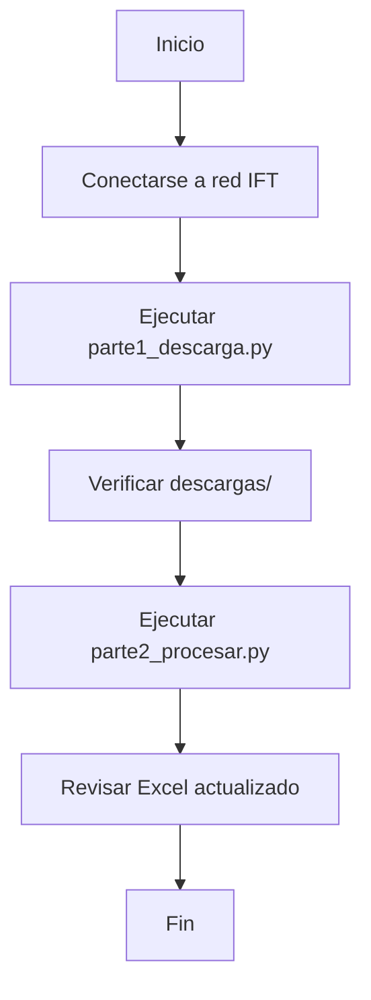

# 📋 Proyecto SATyS - Automatización de Descargas y Procesamiento

**Sistema Automatizado de Trámites y Servicios (SATyS)**
**Comisión Reguladora de Telecomunicaciones (IFT)**

---

## 🎯 Descripción General

Automatización completa del flujo de trabajo para la descarga, procesamiento y organización de archivos del sistema SATyS del Instituto Federal de Telecomunicaciones (IFT). El sistema extrae información de documentos PDF, consulta el Registro Público de Concesiones (RPC) y actualiza automáticamente una hoja de cálculo de control.

### 🔄 Flujo Completo del Proceso

```
┌─────────────────────────────────────────────────────────────┐
│                    PROYECTO SATyS                            │
├─────────────────────────────────────────────────────────────┤
│                                                              │
│  PARTE 1 — DESCARGA AUTOMÁTICA                              │
│  ├── Login en https://satys.ift.org.mx/                     │
│  ├── Navegación: Enlace/SIGEDO → Oficialía de Partes        │
│  ├── Búsqueda de folios en DataTable                        │
│  ├── Descarga de archivos asociados                         │
│  └── Organización en /descargas/<folio>/                    │
│                                                              │

│  PARTE 3 — BÚSQUEDA EN RPC                                  │
│  ├── Consulta en https://rpc.ift.org.mx/vrpc/               │
│  ├── Búsqueda por nombre del operador                       │
│  ├── Extracción de folio RPC (FET099560AU-XXXXXX)           │
│  └── Construcción de ruta estandarizada                     │
│                                                              │
│  PARTE 4 — ACTUALIZACIÓN DE EXCEL                           │
│  ├── Localización de fila por folio                         │
│  ├── Inserción de datos extraídos                           │
│  ├── Marcado de formatos (1 en columna correspondiente)     │
│  └── Registro de tipos de archivo descargados               │
│                                                             │
│  PARTE 2 — EXTRACCIÓN DE DATOS PDF (No implementado)        │
│  ├── Localización del archivo PDF en carpeta                │
│  ├── Extracción de texto con pdfplumber                     │
│  ├── Identificación de:                                     │
│  │   ├── Nombre o razón social del Operador                 │
│  │   ├── Representante Legal                                │
│  │   └── Formatos marcados con "X" (R001-R027)              │
│  └── Corrección de errores OCR con fuzzywuzzy               │
│                                                             │
└─────────────────────────────────────────────────────────────┘
```

---

## 📁 Estructura del Proyecto

```
proyecto_satys/
│
├── parte1_descarga.py          # Script de descarga automática
├── parte2_procesar.py          # Script de extracción y procesamiento
├── README.md                   # Este archivo
├── requirements.txt            # Dependencias del proyecto
│
├── descargas/                  # Carpeta de archivos descargados (temporales)
│   ├── 6801/
│   ├── 6802/
│   └── descarga_log.json
│
├── output/                     # Carpeta de resultados finales (organizados por RPC)
│   ├── 518998_operador_a/
│   └── ...
│
└── TrámitesCRT.xlsx            # Excel de control (actualizado)
```

---

## 🔧 Requisitos del Sistema

### Hardware
- Procesador: 2 GHz o superior
- RAM: 4 GB mínimo (8 GB recomendado)
- Espacio en disco: 500 MB para dependencias
- Conexión a Internet: **Acceso a red del IFT** (obligatorio para SATyS)

### Software
- **Sistema Operativo**: Windows 10/11, macOS 11+, Linux
- **Python**: 3.10 o superior
- **Navegador**: Chromium (instalado automáticamente por Playwright)

### Dependencias Python

```bash
pip install playwright pdfplumber fuzzywuzzy python-Levenstein openpyxl
playwright install chromium
```

Ver `requirements.txt` para lista completa.

---

## 📦 Instalación

### 1. Clonar o descargar el proyecto

```bash
git clone <repositorio>
cd proyecto_satys
```

### 2. Crear entorno virtual (recomendado)

```bash
# Windows
python -m venv venv
venv\Scripts\activate

# macOS/Linux
python3 -m venv venv
source venv/bin/activate
```

### 3. Instalar dependencias

```bash
pip install -r requirements.txt
playwright install chromium
```

### 4. Verificar instalación

```bash
python -c "import playwright; import pdfplumber; import openpyxl; print('✅ Todo listo')"
```

---

## 🚀 Uso

### Orquestador Principal (Recomendado)

```bash
# Iniciar el MENÚ INTERACTIVO (Solicita folio inicial y final)
python main_procesar.py

# Modo desatendido con folios específicos
python main_procesar.py 6801 6802 6407
```

### PARTE 1 — Descarga de Archivos (Individual)

```bash
# Con folios por defecto (6801, 6802)
python parte1_descarga.py

# Con folios específicos
python parte1_descarga.py 6801 6802 6407 9493

# Modo headless (sin ventana del navegador)
# Editar HEADLESS = True en el script
```

**Salida:**
```
descargas/
├── 6801/
│   ├── CRT26-XXXXXX.pdf
│   ├── R002-01.xlsx
│   └── archivo_adicional.docx
├── 6802/
│   └── ...
└── descarga_log.json
```

### PARTE 2-4 — Procesamiento y Actualización de Excel

```bash
# Procesar folios específicos
python parte2_procesar.py 6801 6802

# Procesar todas las carpetas en descargas/
python parte2_procesar.py
```

**Acciones realizadas:**
1. Extrae texto del PDF en cada carpeta
2. Identifica nombre del operador, representante legal y formatos
3. Corrige errores de OCR
4. Busca el operador en el RPC
5. Actualiza el Excel `TrámitesCRT (1).xlsx`

---

## ⚙️ Configuración

### Credenciales SATyS

Editar en `parte1_descarga.py`:
```python
USUARIO  = "david.palestina@ift.org.mx"
PASSWORD = "Crt20261234*"
```

### Opciones de Visualización

```python
HEADLESS = False   # True = sin ventana | False = ver navegador
TIMEOUT  = 30_000  # Timeout en milisegundos
```

### Folios por Defecto

```python
FOLIOS_DEFAULT = ["6802", "6801"]
```

---

## 📊 Columnas del Excel Actualizadas

| Columna | Letra | Contenido | Ejemplo |
|---------|-------|-----------|---------|
| 1711 | D | Nombre del PDF sin extensión | CRT26-009493 |
| Solicitante Promovente | F | Nombre del operador | TELECOMUNICACIÓN Y MERCADOTECNIA DE MONTERREY, S.A. DE C.V. |
| Representante Legal | G | Nombre del representante | JOSÉ JORGE MENA ORTIZ |
| Ruta | N | Ruta construida desde RPC | 518998_telecomunicación_y_mercadotecnia_de_monterrey_s_a_de_c_v\01 EN\VE |
| R001-R027 | O-AQ | "1" si el formato está marcado en PDF | 1 |
| NOTAS_VICTOR | AP | Tipos de archivo descargados | Archivos: xlsx, csv |

---

## 🔍 Formato de Ruta RPC

### Entrada (desde RPC)
```
FET099560AU-518998 - TELECOMUNICACIÓN Y MERCADOTECNIA DE MONTERREY, S.A. DE C.V.
```

### Salida (en Excel)
```
518998_telecomunicación_y_mercadotecnia_de_monterrey_s_a_de_c_v\01 EN\VE
```

### Reglas de conversión:
1. Extraer número después del guión (518998)
2. Convertir nombre a minúsculas
3. Eliminar caracteres especiales (.,)
4. Reemplazar espacios por guiones bajos
5. Agregar sufijo `\01 EN\VE`

---

## 🛠️ Herramientas Utilizadas

| Herramienta | Versión | Uso | Licencia |
|-------------|---------|-----|----------|
| **Playwright** | 1.40+ | Automatización web (SATyS + RPC) | Apache 2.0 |
| **pdfplumber** | 0.10+ | Extracción de texto PDF | MIT |
| **openpyxl** | 3.1+ | Lectura/escritura Excel | MIT |
| **fuzzywuzzy** | 0.18+ | Corrección de texto OCR | GPL v2 |
| **python-Levenstein** | 0.25+ | Aceleración de fuzzywuzzy | GPL v2 |

---

## ⚠️ Limitaciones y Consideraciones

### Acceso a Red
- **SATyS solo es accesible desde la red interna del IFT**
- El RPC (rpc.ift.org.mx) es accesible públicamente
- Se requiere VPN o conexión física a la red del IFT

### Tiempos de Ejecución

| Operación | Tiempo Estimado |
|-----------|-----------------|
| Login SATyS | 5-10 segundos |
| Descarga por folio | 15-30 segundos |
| Procesamiento PDF | 2-5 segundos |
| Búsqueda RPC | 5-10 segundos |
| Actualización Excel | 1-2 segundos |

### Errores Comunes

| Error | Causa | Solución |
|-------|-------|----------|
| `Timeout en login` | Credenciales incorrectas o red no disponible | Verificar credenciales y conexión VPN |
| `Folio no encontrado` | Folio no existe en Documentos en Proceso | Verificar número de folio |
| `Sin resultados RPC` | Nombre del operador mal extraído del PDF | Revisar calidad del OCR en PDF |
| `Excel no actualizado` | Archivo abierto en otra aplicación | Cerrar Excel antes de ejecutar |

---

## 🔄 Flujo de Trabajo Recomendado



---

## 📝 Logs y Monitoreo

### Archivos de Log Generados

```
descargas/descarga_log.json    # Registro detallado de descargas
```

### Formato del Log

```json
{
  "fecha_ejecucion": "2026-01-15T10:30:00",
  "total_archivos": 4,
  "total_exitosos": 4,
  "total_errores": 0,
  "resultados": [
    {
      "folio": "6802",
      "archivo": "CRT26-009493.pdf",
      "tipo": "PDF",
      "ruta": "descargas/6802/CRT26-009493.pdf",
      "tamano_kb": 245.3,
      "ok": true
    }
  ]
}
```

---

## 🧪 Pruebas

### Casos de Prueba

```bash
# Prueba 1: Descarga de un solo folio
python parte1_descarga.py 6802

# Prueba 2: Procesamiento de PDF
python parte2_procesar.py 6802

# Prueba 3: Flujo completo con múltiples folios
python parte1_descarga.py 6802 6801
python parte2_procesar.py 6802 6801
```

### Validación

- [ ] Verificar que los archivos se descargan en la carpeta correcta
- [ ] Confirmar que el nombre del operador se extrae correctamente
- [ ] Validar que la búsqueda en RPC retorna resultados
- [ ] Revisar que el Excel se actualiza sin errores
- [ ] Comprobar que los formatos se marcan con "1" donde corresponde

---

## 🔮 Próximas Mejoras (Roadmap)

### Fase 1 - Optimización
- [ ] Descubrimiento de API subyacente de SATyS
- [ ] Paralelización de descargas
- [ ] Bloqueo de recursos innecesarios (imágenes, fuentes)

### Fase 2 - Robustez
- [ ] Reintentos automáticos en caso de timeout
- [ ] Capturas de pantalla automáticas en errores
- [ ] Validación de integridad de archivos descargados

### Fase 3 - Funcionalidades
- [ ] Interfaz gráfica simple (GUI)
- [ ] Programación de ejecuciones automáticas
- [ ] Notificaciones por correo electrónico

---

## 👤 Autor

**Proyecto desarrollado para:**
- Instituto Federal de Telecomunicaciones (IFT)
- Coordinación General de Planeación Estratégica
- Dirección General Adjunta de Estadística y Análisis de Indicadores

**Desarrollador:** David Palestina Ramirez

**Contacto:** david.palestina@ift.org.mx

---

## 📄 Licencia

Este proyecto es propiedad del Instituto Federal de Telecomunicaciones (IFT). Uso interno exclusivamente.

---

## 📚 Referencias

- [Documentación de Playwright](https://playwright.dev/python/)
- [Documentación de pdfplumber](https://github.com/jsvine/pdfplumber)
- [Documentación de openpyxl](https://openpyxl.readthedocs.io/)
- [Registro Público de Concesiones](https://rpc.ift.org.mx/vrpc/)
- [SATyS - Sistema Automatizado de Trámites y Servicios](https://satys.ift.org.mx/)

---

**Última actualización:** Mayo 2026