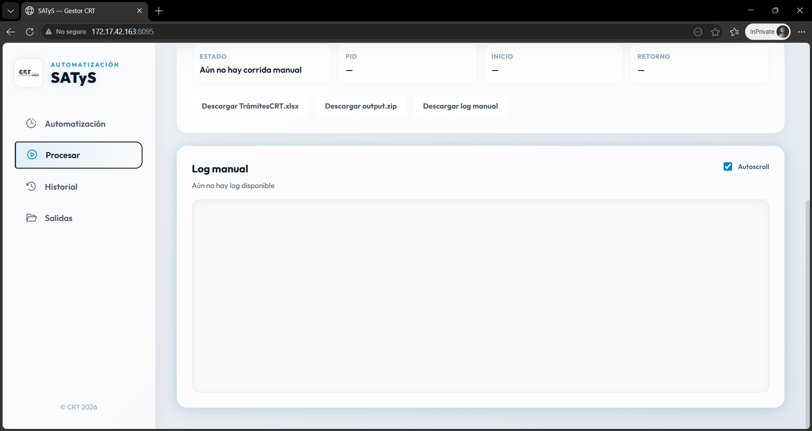
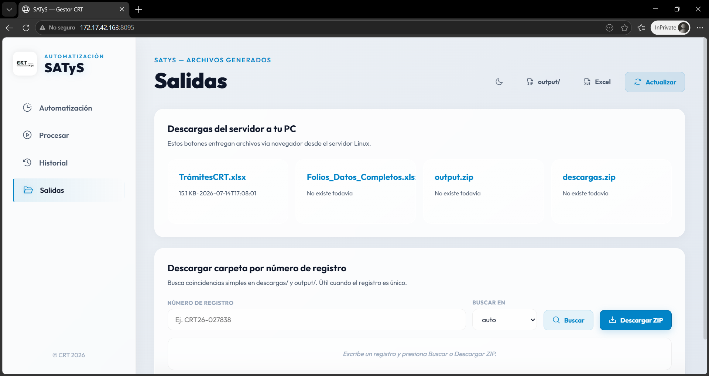

# Automatización SATyS — versión portable

> **Inicio recomendado:** consulta [`QUICKSTART_PORTABLE.md`](QUICKSTART_PORTABLE.md). La ruta principal es una imagen OCI reproducible; `venv + systemd` queda como compatibilidad/rollback. Puerto del panel: **8082**.

# 📋 Proyecto SATyS - Automatización de Descargas y Procesamiento (Linux)

**Sistema Automatizado de Trámites y Servicios (SATyS)**
**Comisión Reguladora de Telecomunicaciones (CRT)**

.

---

## 🎯 Descripción general

Automatización del flujo completo de **descarga, procesamiento y organización** de trámites del sistema SATyS del IFT/CRT. El sistema:

- Revisa todos los días la tabla **Documentos en Proceso** del SATyS y detecta números de **Registro** nuevos comparando contra `TrámitesCRT.xlsx` (columna `1711`).
- Extrae metadatos del trámite directamente de la web (sin OCR).
- Descarga en paralelo todos los archivos asociados a cada registro/folio, con reintentos automáticos.
- Consulta el RPC primero por el Excel oficial (`id_solicitante == ID OPERADOR` o nombre canónico único) y, si no resuelve, usa el buscador público actual del RPC.
- Actualiza `TrámitesCRT.xlsx` y organiza los archivos descargados en `/output/<operador>/`.
- Genera un Excel consolidado (`output/Folios_Datos_Completos.xlsx`) con todos los campos extraídos.
- Conserva los JSON de control exclusivamente en `descargas/`; las carpetas de
  expedientes bajo `output/` contienen sólo los archivos reales descargados.
- Reconcilia automáticamente `TrámitesCRT.xlsx` contra ese consolidado: una fila por Registro, rutas completas y sin filas fantasma de ZIP.
- Envía un único correo diario consolidado para Internos y Oficialía, con sólo los indicadores y rutas esenciales.
- Corre de forma desatendida vía `systemd` (timer diario) y expone un panel web (FastAPI) para monitoreo y ejecución manual.

### 🔄 Flujo del proceso

```
┌───────────────────────────────────────────────────────────────────┐
│                          PROYECTO SATyS                             │
├───────────────────────────────────────────────────────────────────┤
│  MONITOR DIARIO (automatizar_registros_diario.py)                   │
│  ├── Login en https://satys.ift.org.mx/                             │
│  ├── Extrae columna "Registro" de Documentos en Proceso             │
│  ├── Compara contra TrámitesCRT.xlsx (columna 1711)                 │
│  └── Genera registros.txt solo con registros nuevos                 │
│                                                                       │
│  PARTE 1 — DESCARGA (Playwright, headless)                          │
│  ├── Búsqueda del registro/folio en Oficialía de Partes              │
│  ├── Extracción de metadatos del trámite vía JS de la página        │
│  ├── Descarga en paralelo de todos los archivos asociados           │
│  │   └── Hasta 3 intentos por archivo → si falla: ERROR_SERVIDOR    │
│  ├── Descompresión de los .zip encontrados                          │
│  └── Organización temporal en descargas/<registro>/                 │
│                                                                       │
│  PARTE 3 — BÚSQUEDA EN RPC                                          │
│  ├── Descarga/actualización del catálogo de Concesiones             │
│  ├── Comparación exacta id_solicitante == ID OPERADOR               │
│  │   (100% si existe en el Excel oficial, 0% si no existe)          │
│  └── Construcción de ruta estandarizada por operador                │
│                                                                       │
│  PARTE 4 — EXCEL Y CARPETAS                                         │
│  ├── Inserción de resultados en TrámitesCRT.xlsx                    │
│  └── Copia final a output/<operador>/ o _sin_operador/(correos)/ │
│                                                                       │
│  EXPORTACIÓN FINAL                                                   │
│  ├── Genera/actualiza output/Folios_Datos_Completos.xlsx            │
│  ├── Reconcilia TrámitesCRT.xlsx por número de Registro             │
│  ├── Sobrescribe TrámitesCRT.xlsx y hace merge de output/ y descargas/ en CRT Recurso DEPI
│  └── Envía un único correo consolidado de Internos + Oficialía      │
└───────────────────────────────────────────────────────────────────┘
```

> `Parte2_extraer.py` (extracción de PDF vía Azure/pdfplumber) se conserva por compatibilidad pero **no se usa en producción**; el flujo real usa los metadatos obtenidos directamente del SATyS.

---

## 🖥️ Panel web (reemplaza la GUI de Windows)

La antigua interfaz de escritorio (Flet) fue reemplazada por un panel web servido con **FastAPI** (`satys_api.py`), sin frameworks de frontend ni build tools — solo HTML/CSS/JS servidos directamente.

Incluye:

1. **Automatización diaria**: estado en vivo del timer/servicio `systemd`, resumen de la última corrida y log en tiempo real.
2. **Procesar manualmente**: subir un `.txt` de folios o de registros y lanzar una corrida sin usar la terminal.
3. **Historial**: corridas diarias y manuales anteriores.
4. **Descargas**: `TrámitesCRT.xlsx`, `output/Folios_Datos_Completos.xlsx`, `output.zip`, `descargas.zip`.

Levantar en modo prueba:

```bash
uvicorn satys_api:app --host 127.0.0.1 --port 8082
```

> **Producción:** el panel/API escucha únicamente en `127.0.0.1:8082`. No se debe
> publicar Uvicorn directamente en la red. El acceso externo debe entrar por nginx
> con TLS/HTTPS; se incluye un ejemplo en `deploy/nginx-satys.conf`.

La API canónica está versionada bajo `/api/v1`. Swagger está disponible en `/docs`, ReDoc en `/redoc` y la referencia mantenida en el repositorio es [`docs/API.md`](docs/API.md). Los aliases `/api/...` anteriores se conservan temporalmente para compatibilidad.

Detalles completos de endpoints y variables en [`README_FRONTEND_LINUX.md`](README_FRONTEND_LINUX.md).

## Screenshots







---

## 📁 Estructura del proyecto

```
Automatizacion-SATyS/
│
├── main_procesar.py                  # Orquestador principal (Partes 1, 3, 4 + Excel consolidado)
├── automatizar_registros_diario.py   # Monitor diario: detecta registros nuevos y llama a main_procesar.py
├── Parte1_descarga.py                # Automatización web del SATyS (Playwright)
├── Parte2_extraer.py                 # Extracción de PDFs (Azure AI / pdfplumber) — no usado en producción
├── Parte3_rpc.py                     # Búsqueda y homologación en el RPC
├── Parte4_excel.py                   # Escritura en TrámitesCRT.xlsx y organización de /output/
├── extraer_registros_documentos.py   # Extrae la tabla "Documentos en Proceso" del SATyS
├── generar_excel_folios.py           # Generación del Excel consolidado (versión folios)
├── generar_excel_metadata_json.py    # Generación de output/Folios_Datos_Completos.xlsx desde JSON
├── buscar_concesionario.py           # Búsqueda exacta en el padrón RPC
├── descargar_concesiones_rpc.py      # Descarga/actualización del catálogo RPC
├── login_satys.py                    # Login al SATyS
├── notificar_email.py                # Correo esencial; el monitor diario lo envía una sola vez
├── configuracion_local.py             # Lector de config/configuracion_local.json
├── estado_descargas.py                # Regla única de completo/reintento
├── sincronizacion_depi.py             # Merge no destructivo hacia CRT Recurso DEPI
├── config/configuracion_local.json    # Credenciales/rutas locales (chmod 600; no versionar)
├── proceso_lock.py                   # Lock compartido para evitar corridas simultáneas
├── estado_ejecucion.py               # Escribe logs/estado_actual.json (estado vivo para el panel)
├── satys_api.py                      # Backend FastAPI del panel web
│
├── web/
│   ├── templates/index.html          # Panel web
│   └── static/                       # CSS y JS del panel
│
├── scripts/
│   ├── run_satys_diario.sh           # Wrapper de ejecución diaria (usado por systemd)
│   ├── estado_satys.sh               # Diagnóstico rápido de servicio/timer/estado
│   └── health_satys.py               # Lee logs/estado_actual.json y valida frescura
│
├── systemd/
│   ├── satys-diario.service          # Corrida diaria (oneshot)
│   ├── satys-diario.timer            # Programación diaria (01:00 AM, America/Mexico_City)
│   └── satys-api.service             # Servicio del panel web (FastAPI/uvicorn)
│
├── TrámitesCRT.xlsx                  # Hoja de control maestro
├── requirements-linux.txt            # Dependencias Python para Linux
│
├── descargas/<registro>/             # Carpeta de tránsito (archivos recién descargados)
├── output/                           # Destino final organizado por operador
│   ├── <id>_<nombre_operador>/
│   ├── _sin_operador/
│   │   └── (correos)/                 # Todo sin operador y folio_opc CORREO
│   └── Folios_Datos_Completos.xlsx   # Excel consolidado
├── registros_diarios/                # Copias históricas de los TXT de registros detectados
├── base_de_datos_rpc/                # Catálogo de Concesiones RPC descargado
└── logs/                             # Logs de ejecución y estado_actual.json
```

Documentación adicional incluida en el repo:

- [`README_BACKEND_LINUX.md`](README_BACKEND_LINUX.md) — instalación, `systemd`, variables de entorno, monitoreo.
- [`README_FRONTEND_LINUX.md`](README_FRONTEND_LINUX.md) — panel web, endpoints, permisos de la UI.
- [`README_ESTADO_SERVIDOR_ACTUAL.md`](README_ESTADO_SERVIDOR_ACTUAL.md) — bitácora del despliegue real en el servidor (rutas, montajes, troubleshooting).
- [`INSTRUCCIONES_DESPLIEGUE_FINAL_LOCK_SATYS.md`](INSTRUCCIONES_DESPLIEGUE_FINAL_LOCK_SATYS.md) — checklist de despliegue con lock seguro y correo.

---

## 📍 Ruta canónica del paquete compartido DEPI

En este proyecto, cualquier ejemplo que use `/ruta/<archivo>.zip` **no es una ruta literal**. El directorio compartido canónico para los paquetes de despliegue es siempre:

```text
/depi/DEI_DATOS/SATyS/satys_fullstack_montaje_depi/Automatizacion-SATyS
```

Por ejemplo, la ruta completa del parche de reanudación es:

```text
/depi/DEI_DATOS/SATyS/satys_fullstack_montaje_depi/Automatizacion-SATyS/parche-satys-reanudacion-id-20260717.zip
```

Se recomienda declarar la ruta una sola vez:

```bash
ORIGEN_DEPI=/depi/DEI_DATOS/SATyS/satys_fullstack_montaje_depi/Automatizacion-SATyS
PATCH_ZIP="$ORIGEN_DEPI/parche-satys-reanudacion-id-20260717.zip"
test -f "$PATCH_ZIP"
```

El proyecto que ejecutan `systemd` y la UI continúa instalado en:

```text
/data/gustavo.garcia/satys/Automatizacion-SATyS
```

La carpeta DEPI es el origen compartido de paquetes y salidas; no debe confundirse con la copia activa del servidor.

### Si ya existe una corrida con archivos descargados

No borres ni reemplaces `descargas/`, `output/`, `TrámitesCRT.xlsx`, `config/` ni
`logs/`. Aplica únicamente el parche por superposición. La corrida diaria sólo
omite una descarga cuando `metadata_completo.json`, sus conteos y todos los
archivos físicos superan la auditoría estricta. Las carpetas vacías, parciales
o que contienen únicamente JSON se conservan y vuelven a entrar a descarga;
toda carpeta de expediente existente entra además a metadatos, RPC, Excel y
organización sin que se elimine de `descargas/`.

Para reparar solamente los `id_solicitante` vacíos de una corrida anterior, primero analiza y después ejecuta el reparador **sin** `--redescargar-archivos`:

```bash
/data/gustavo.garcia/satys/venv/bin/python reparar_id_solicitante.py \
  --reiniciar-cola \
  --solo-analizar

/data/gustavo.garcia/satys/venv/bin/python reparar_id_solicitante.py \
  --reintentos 2 \
  --headless
```

El modo predeterminado vuelve a consultar SATyS únicamente para completar el metadato y reutiliza los documentos existentes. Usa `--redescargar-archivos` solo como último recurso y después de respaldar `descargas/`, porque puede crear duplicados.

### Ejecución automática y manual

- `satys-diario.timer` genera una activación de calendario cada día a las **01:00:00 `America/Mexico_City`**.
- `Persistent=false` mantiene el horario estricto: si el servidor está apagado a la 01:00, no se dispara una corrida tardía al encenderlo.
- `satys-diario.service` usa `Restart=no`: los errores de negocio o registros fallidos no vuelven a lanzar toda la automatización.
- `scripts/run_satys_diario.sh` añade una guarda por fecha en `runs/daily_guard/`; un segundo arranque normal del mismo día se omite sin enviar correo.
- La misma corrida diaria puede solicitarse manualmente desde la UI o con `sudo systemctl start --no-block satys-diario.service`, pero la guarda evita una segunda ejecución en la misma fecha.
- `reparar_id_solicitante.py` es **exclusivamente manual**: no está asociado a ningún timer.
- El bloqueo del proyecto impide que la corrida diaria, una corrida manual y el reparador modifiquen simultáneamente los mismos archivos.

El monitor diario invoca los procesadores de Internos y Oficialía con
`--sin-email`. Al concluir combina ambos logs y envía exactamente un resumen con
total, exitosos, fallidos/revisión manual, errores, tipos de expediente,
resoluciones por Excel/web y las rutas de `output`, `descargas` y los tres Excel.

> Release actual: `2026.08.27-rpc-diario-correo-unico1`.
> Guía de despliegue nuevo: [`DESPLIEGUE_NUEVO.md`](DESPLIEGUE_NUEVO.md).
> Trazabilidad del backlog: [`docs/BACKLOG_IMPLEMENTACION.md`](docs/BACKLOG_IMPLEMENTACION.md).

## 📦 Instalación

### Contenedor OCI (método estándar y portable)

El host sólo necesita Docker Compose o Podman. Python, dependencias y Chromium/Playwright pertenecen a la imagen. Las rutas del host se definen en `.env`; no se compilan rutas `/data/...` o `/depi/...` dentro de la imagen.

```bash
cp .env.example .env
bash scripts/bootstrap_portable.sh
# editar config/configuracion_local.json si es una instalación nueva
bash scripts/satys.sh doctor
bash scripts/satys.sh build
bash scripts/satys.sh api-up
```

La API se publica sólo en `127.0.0.1:8082` por defecto. Para RHEL sin Compose, `scripts/podman_satys.sh` ejecuta la misma imagen directamente con Podman. En Windows PowerShell existe `scripts/satys.ps1`.

Consulta [`QUICKSTART_PORTABLE.md`](QUICKSTART_PORTABLE.md), [`DESPLIEGUE_NUEVO.md`](DESPLIEGUE_NUEVO.md) y [`docs/PORTABILIDAD.md`](docs/PORTABILIDAD.md).

### Instalación sin contenedor (compatibilidad/rollback)

El flujo `venv + systemd` sigue disponible mediante `scripts/instalar_linux_1am.sh`, pero no es el camino recomendado para una computadora o servidor nuevos porque requiere instalar Python, dependencias del navegador y Chromium en el host.

---

## ⚙️ Configuración portable

`config/configuracion_local.json` mantiene la configuración funcional. Las rutas pueden ser relativas al proyecto y todas las rutas relevantes también admiten override por variables de entorno. Ejemplo portable:

```json
{
  "satys": {"usuario": "...", "password": "..."},
  "gmail": {"remitente": "...", "app_password": "...", "destinatarios": []},
  "rutas": {
    "descargas": "descargas",
    "output": "output",
    "excel": "TrámitesCRT.xlsx",
    "carpeta_compartida": "shared"
  },
  "procesamiento": {
    "workers": 10,
    "internos_workers": 12,
    "timeout_registro": 900,
    "reintentos_registro": 2,
    "workers_reintento": 2
  }
}
```

Variables de despliegue principales: `SATYS_RUNTIME_DIR`, `SATYS_SHARED_HOST_DIR`, `SATYS_LOCK_HOST_DIR`, `SATYS_CONFIG_HOST_FILE`, `SATYS_API_PORT`, `SATYS_INTERNOS_WORKERS` y `SATYS_SHM_SIZE`. Dentro del contenedor el recurso compartido siempre se monta como `/shared`.

Las credenciales pueden permanecer en `config/configuracion_local.json` o suministrarse mediante `SATYS_USUARIO`, `SATYS_PASSWORD`, `SATYS_EMAIL_REMITENTE` y `SATYS_EMAIL_APP_PASSWORD`. El archivo real y `.env` están excluidos de Git y de las releases.

## 🚀 Uso en terminal

```bash
# Procesar registros/folios específicos:
python main_procesar.py 6407 6801

# Procesar desde un archivo de folios:
python main_procesar.py --archivo-folios folios.txt --headless --workers 10

# Procesar desde un archivo de números de Registro (ej. CRT26-002483):
python main_procesar.py --archivo-registro registros.txt --headless --workers 10

# Ejecutar exclusivamente todos los Folios de las seis bandejas de Internos IFT:
python main_procesar.py --todos-internos --headless --internos-workers 12

# El mismo recorrido mediante el lanzador Linux:
SATYS_INTERNOS_WORKERS=12 bash scripts/run_satys_internos.sh

# En Windows PowerShell:
powershell -ExecutionPolicy Bypass -File .\scripts\run_satys_internos.ps1 -Workers 12

# Solo Internos IFT con filtro de nuevos contra la hoja Internos (OCI/Podman/Docker):
bash scripts/satys.sh internos

# Ejecución directa sin contenedor:
bash scripts/run_satys_internos_nuevos.sh

# El mismo modo filtrado en Windows PowerShell:
powershell -ExecutionPolicy Bypass -File .\scripts\run_satys_internos_nuevos.ps1

# Revisar de principio a fin un solo Folio de Internos en Windows, sin correo:
powershell -ExecutionPolicy Bypass -File .\scripts\procesar_folio_internos.ps1 148326 -Visible

# La misma revisión en Linux con Python/venv:
bash scripts/procesar_folio_internos.sh 148326

# En Docker o Podman portable:
bash scripts/satys.sh folio 148326

# Solo procesar archivos ya descargados (sin entrar al SATyS):
python main_procesar.py --solo-procesar

# Reconstruir el catálogo RPC desde cero:
python main_procesar.py --rebuild-catalogo

# Ejecutar el monitor diario manualmente (detecta y procesa solo lo nuevo):
python automatizar_registros_diario.py --headless --workers 10

# Monitor manual limitado a las seis bandejas de Internos IFT:
python automatizar_registros_diario.py --solo-internos --headless
```

`--todos-internos` reprocesa todos los Folios visibles. Para una corrida normal
que compare `Folio Internos` y procese únicamente pendientes, usa
`automatizar_registros_diario.py --solo-internos` o el lanzador
`run_satys_internos_nuevos`.

La descarga de Internos usa procesos aislados por segmento. Cada worker publica
un heartbeat al iniciar, paginar y terminar cada Folio. Si deja de avanzar por
`--timeout-registro` segundos, se termina su árbol completo de procesos
(incluido Chromium), se conservan los objetivos ya auditados y se reencolan
únicamente los incompletos. `--reintentos-registro 2` permite tres intentos
totales, igual que el modo Registro de Oficialía.

### Auditoría única de descargas incompletas

La misma auditoría se usa para cualquier expediente de Internos, Oficialía,
Trámites Nuevos y los modos por Registro o Folio. Un expediente vuelve a la
cola de descarga cuando se cumple cualquiera de estas condiciones:

- la carpeta no existe, no es directorio, está vacía o sólo contiene JSON;
- no existe `metadata_completo.json`, no puede leerse o no contiene un objeto;
- no hay archivos reales, existe un temporal (`.part`, `.crdownload`, etc.),
  un archivo real tiene 0 bytes o queda un ZIP pendiente de extracción;
- `estado` no es `OK`, `coincide` es falso o el recorrido de documentos del
  portal quedó incompleto;
- la lista `archivos` está ausente, vacía, dañada o contiene algún `ok=false`;
- los conteos total, correctos y errores faltan, son inválidos o no coinciden;
- no todos los archivos quedaron `OK`, falta su nombre o un archivo reportado
  como correcto ya no existe físicamente.

La auditoría es sólo lectura. El descargador reutiliza la carpeta existente y
fusiona/sobrescribe únicamente los archivos recuperados; nunca elimina una
carpeta de expediente bajo `descargas/`. Sólo retira temporales fallidos y un
ZIP después de haberlo extraído satisfactoriamente.

`--folio-internos FOLIO` fuerza el recorrido completo de un Folio numérico,
aunque ya exista en Excel, y deshabilita siempre el correo. Después comprueba
la hoja `Internos` y cada carpeta final declarada bajo `output/`. El modo
puntual omite la sincronización masiva del histórico hacia DEPI para que la
terminal cierre al terminar las salidas locales. También resuelve de forma
automática los anexos que abren primero la ventana morada `Archivo PDF`: pulsa
su segundo `VER DOCUMENTO`, captura la pestaña emergente y descarga el archivo.

### Argumentos de `main_procesar.py`

| Argumento                        | Descripción                                                                            |
| -------------------------------- | --------------------------------------------------------------------------------------- |
| `[folios]`                     | Folios a procesar como argumentos posicionales                                          |
| `--archivo-folios`             | Ruta a`.txt` con folios, uno por línea                                               |
| `--archivo-registro`           | Ruta a`.txt` con números de Registro; activa el modo de búsqueda por Registro       |
| `--todos-internos`             | Solo Internos IFT: recorre las seis bandejas, descarga, procesa y actualiza`Internos` |
| `--internos-workers N`         | Navegadores paralelos para Internos (default: 12; sin máximo artificial; `0` usa uno por bandeja) |
| `--solo-procesar`              | Omite la descarga (Parte 1) y procesa solo archivos ya locales                          |
| `--headless`                   | Oculta el navegador de Playwright                                                       |
| `--workers N`                  | Ventanas de navegador en paralelo (default: 10)                                         |
| `--timeout-registro N`         | Timeout sin avance por registro/Folio Internos en segundos (default: 900)                |
| `--reintentos-registro N`      | Reintentos para registros u objetivos Internos incompletos (default: 2; 3 intentos)       |
| `--workers-reintento N`        | Workers usados en los reintentos (default: 2)                                           |
| `--buscar N` / `--desde X`   | Búsqueda secuencial de`N` folios a partir de `X`                                   |
| `--no-organizar`               | Actualiza el Excel pero no mueve archivos a`/output/`                                 |
| `--rebuild-catalogo`           | Reconstruye el catálogo RPC desde cero                                                 |
| `--rpc-online` / `--sin-rpc-online` | Fuerza u omite el respaldo en el buscador público RPC; la corrida diaria siempre lo fuerza |
| `--sin-email` / `--email-to` | Omite o redirige la notificación por correo                                            |
| `--sin-lock`                   | No toma el lock compartido (usado internamente cuando el monitor diario ya lo tomó)    |

### Argumentos propios de `automatizar_registros_diario.py`

| Argumento                                       | Descripción                                                             |
| ----------------------------------------------- | ------------------------------------------------------------------------ |
| `--excel`, `--sheet`, `--header-registro` | Excel/columna contra la que se compara para detectar registros nuevos    |
| `--registros-latest`, `--registros-dir`     | TXT de salida y carpeta de copias históricas                            |
| `--max-paginas`, `--timeout-tabla`          | Paginación y timeout al leer la tabla "Documentos en Proceso"           |
| `--no-procesar`                               | Solo genera el TXT de nuevos registros, sin ejecutar`main_procesar.py` |
| `--visible`                                   | Fuerza navegador visible para depuración                                |
| `--estado-json`                               | Ruta del JSON de estado vivo                                             |

---

## ⏱️ Automatización diaria

### Docker + systemd del host (recomendado)

El contenedor worker no queda ejecutándose. Un timer del host crea una corrida efímera a la 01:00 (`America/Mexico_City`):

```bash
sudo cp systemd/satys-docker-diario.service systemd/satys-docker-diario.timer /etc/systemd/system/
sudo systemctl daemon-reload
sudo systemctl enable --now satys-docker-diario.timer
systemctl list-timers --all | grep satys
```

Ejecución manual equivalente:

```bash
docker compose run --rm satys-worker
```

### `venv` + systemd (alternativa)

Los archivos `systemd/satys-diario.service`, `systemd/satys-diario.timer` y `systemd/satys-api.service` continúan disponibles para el despliegue histórico sin contenedores. Consulta [`DESPLIEGUE_1AM.md`](DESPLIEGUE_1AM.md).

---

## 🔒 Lock compartido

`proceso_lock.py` evita que dos corridas se ejecuten al mismo tiempo. En corridas manuales/API, `main_procesar.py` toma el lock. En la corrida diaria, `automatizar_registros_diario.py` toma el lock y llama a `main_procesar.py --sin-lock`. El lock se libera siempre en `finally` (al terminar, fallar, `Ctrl+C` o `systemctl stop`). Si el proceso murió de forma abrupta (apagón, `kill -9`), y ya se confirmó que no quedan procesos vivos, el lock puede liberarse manualmente:

```bash
ps -ef | grep -E 'main_procesar|automatizar_registros_diario|Parte1_descarga|chromium|playwright' | grep -v grep
rm -f "$SATYS_LOCK_DIR/satys_proceso.lock"
```

---

## Resolución segura de operadores RPC

El cruce usa evidencia exacta en este orden:

1. `metadata_satys.id_solicitante == ID OPERADOR` del Excel local del RPC.
2. Si falta `id_solicitante`, igualdad única entre `nombre_operador` y
   `NOMBRE OPERADOR`, normalizando acentos, puntuación, espacios y mayúsculas.
   Para Internos, si el campo está vacío también intenta recuperarlo de la
   sexta columna tabulada de `texto_fila`.
3. Cuando el Excel no resuelve el registro (o no se puede abrir), consulta
   primero la sección actual de resultados `searchConcesiones` del RPC y luego
   su autocompletado `searchBP`. Acepta igualdad canónica única, la misma razón
   social con distinto sufijo legal o una similitud muy alta (96% por defecto),
   siempre con cobertura de palabras y una ventaja mínima de 5 puntos respecto
   de otro ID.

El catálogo `03_concesiones_permisos_autorizaciones_*.xlsx` local no se
reemplaza por antigüedad. Sólo se descarga si no existe o si se solicita
explícitamente con `--rebuild-catalogo`; esto evita que una publicación dañada
del portal sustituya un archivo local válido.

No se elige el primer resultado ni un nombre individual ambiguo que conduzca a
varios IDs. Esos casos permanecen en `_sin_operador/(correos)` con motivo, puntuación y
candidatos para revisión. Cuando SATyS enumera varias razones sociales completas
en el mismo expediente, cada una se consulta por separado, se conserva el orden
original y la carpeta incluye cada pareja `ID_nombre`, separada con `__`. Una
razón sin ID verificable se conserva como `sin_id_nombre` y se señala en el CSV;
no se inventa ni se hereda el ID de otra empresa. En corridas manuales la
consulta en línea se puede desactivar con `--sin-rpc-online` o
`SATYS_RPC_CONSULTA_ONLINE=0`; la corrida diaria siempre fuerza el respaldo web.
Los umbrales conservadores se ajustan con
`SATYS_RPC_SIMILITUD_MINIMA` y `SATYS_RPC_MARGEN_MINIMO`.

Para reprocesar exclusivamente folios numéricos de Internos ya descargados:

```powershell
python main_procesar.py --internos --solo-procesar `
  --internos-registros numeros_registro.csv --sin-email --sin-sincronizar
```

Cuando también se proporciona `--internos-objetivos`, el archivo
`Folios_Datos_Completos_Internos.xlsx` incluye una fila por cada pareja
`bandeja/folio` solicitada. Los objetivos que agotaron sus intentos aparecen con
`estado_descarga=FALTANTE`; el archivo se reabre y concilia antes de sustituir
la versión anterior, evitando publicar un XLSX incompleto o corrupto.

La ruta final es
`output/<ID>_<nombre_normalizado>/<REGISTRO>/` (o la pareja bandeja/folio en
Internos). Para varias razones sociales es
`output/<ID1>_<nombre1>__<ID2>_<nombre2>.../<REGISTRO>/`. La subcarpeta por expediente evita
que nombres repetidos —por ejemplo `metadata_satys.json`— se sobrescriban entre
trámites del mismo operador. La copia conserva subcarpetas y fusiona de forma
idempotente los archivos de una nueva corrida.

Cada ejecución genera en `logs/`:

- `auditoria_operadores_<modo>_<fecha>.csv`, con todas las decisiones;
- `sin_operador_<modo>_<fecha>.csv`, sólo con pendientes;
- `sin_operador_<modo>_ultimo.csv`, acceso estable al reporte más reciente.

### Destino único de revisión manual y correos

Después de leer los metadatos y resolver el RPC, cualquier expediente que no
obtenga un operador seguro y cualquier `folio_opc` cuyo inicio sea `CORREO`
—por ejemplo `CORREO-271`— se organiza exclusivamente en:

```text
output/_sin_operador/(correos)/<expediente>/
```

La regla es común a las tres bandejas: Administración de solicitudes/Internos
IFT, Administración por Asignación/Trámites Nuevos y Enlace/Oficialía de
Partes. Al final de la corrida también se migran carpetas heredadas ubicadas
directamente bajo `_sin_operador`. Antes de retirar una copia anterior, el
programa fusiona documentos reales, conserva conflictos con sufijo `__legacy`
y verifica el contenido. Esta migración sólo opera en `output` y nunca borra ni
modifica expedientes de `descargas`.

### Política de archivos en `output/`

Los archivos `metadata_satys.json`, `metadata_tramite_nuevo.json` y
`metadata_completo.json` son evidencia interna del proceso y permanecen en
`descargas/`. La organización por operador, `_sin_operador` y `(correos)` copia
recursivamente sólo documentos reales no vacíos; omite todos los `.json`,
temporales y archivos auxiliares. Al iniciar una corrida se retiran también los
JSON heredados de ejecuciones anteriores. La sincronización con DEPI aplica la
misma regla a su carpeta `output/`, sin eliminar los JSON operativos de
`descargas/`.

---

## 📊 Excel consolidado (`output/Folios_Datos_Completos.xlsx`)

Se genera/actualiza al finalizar cada corrida con una fila por registro/folio, agregando todos los campos disponibles en `metadata_satys.json` y `metadata_tramite_nuevo.json` (folio, registro, asunto, operador, representante legal, tipo de trámite, fechas, etc.), más la ruta relativa donde quedó organizado en `output/` y `descargas/`. Si el archivo ya existe, los registros nuevos se agregan al final sin borrar los anteriores.

## 📊 Excel de control (`TrámitesCRT.xlsx`)

| Columna                | Letra | Contenido                                           |
| ---------------------- | ----- | --------------------------------------------------- |
| Solicitante Promovente | F     | Operador encontrado en el RPC                       |
| Ruta                   | N     | Ruta construida desde el padrón RPC                |
| R001–R027             | O–AQ | `"1"` si el formato fue detectado en los archivos |
| NOTAS_VICTOR           | AP    | Tipos de archivo descargados (xlsx, csv, pdf, etc.) |

---

## 🩺 Diagnóstico rápido

```bash
# Panel web
systemctl status satys-api.service --no-pager -l
curl http://127.0.0.1:8082/api/v1/health

# Proceso diario
systemctl list-timers | grep satys
journalctl -u satys-diario.service -n 200 --no-pager

# Estado vivo
cat logs/estado_actual.json
```

Más detalle operativo (montajes de red, permisos, puertos usados) en [`README_ESTADO_SERVIDOR_ACTUAL.md`](README_ESTADO_SERVIDOR_ACTUAL.md).

---

## 🔮 Estado del proyecto

### ✅ Completado

- [X] Migración completa de Windows (Python embebido + Flet) a Linux (`venv` + `systemd`)
- [X] Panel web (FastAPI) para monitoreo y corridas manuales, en reemplazo de la GUI de escritorio
- [X] Automatización diaria vía `systemd timer`, con estado vivo en `logs/estado_actual.json`
- [X] Lock compartido con liberación garantizada en corridas manuales, API y diarias
- [X] Búsqueda RPC por ID exacto, nombre canónico único y respaldo oficial en línea
- [X] Un único correo consolidado al finalizar la corrida diaria
- [X] Exportación de Excel consolidado `Folios_Datos_Completos.xlsx`

### 🔲 Pendiente

- [X] Credenciales retiradas del código y leídas desde `config/configuracion_local.json`
- [ ] Dashboard interactivo de estadísticas
- [ ] Soporte para reanudar desde el último punto en caso de apagón o cierre abrupto
- [ ] Encontrar o crear una API oficial para el sitio SATyS

---

## 👤 Autor

**Proyecto desarrollado para:**

- Comisión Reguladora de Telecomunicaciones (CRT)
- Coordinación General de Planeación Estratégica
- Dirección Ejecutiva de Indicadores (DEI)

**Desarrolladores:**

- Gustavo Ivan Garcia Quiroz
- David Palestina Ramirez

**Actualizaciones y despliegue en Linux:** Equipo de la Dirección Ejecutiva de Indicadores
**Contacto:** david.palestina@crt.gob.mx

---

## 📄 Licencia

Este proyecto es propiedad de la Comisión Reguladora de Telecomunicaciones (CRT). Uso interno exclusivamente.

---

## 🧾 Historial de cambios

El historial técnico que antes estaba disperso al final de este README fue migrado a [`CHANGELOG.md`](CHANGELOG.md). La arquitectura está en [`docs/ARQUITECTURA.md`](docs/ARQUITECTURA.md), el glosario en [`docs/GLOSARIO.md`](docs/GLOSARIO.md) y las reglas de mantenimiento en [`CONTRIBUTING.md`](CONTRIBUTING.md).

## 🚀 Release vigente

Versión: `2026.08.17-produccion-api-v1-docker-8082`.

Construir el artefacto reproducible y verificar su manifest SHA-256:

```bash
python scripts/preparar_release.py
```

La release excluye credenciales, sesiones, Excel y datos operativos. Para un despliegue completamente nuevo, usar [`DESPLIEGUE_NUEVO.md`](DESPLIEGUE_NUEVO.md).
